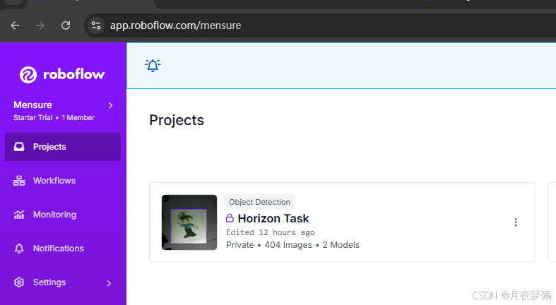

## Intro
RDK X5 is a high-performance robotics development kit designed for intelligent computing and robotics applications, which is developed by D-Robotics, Inc. It is equipped with the latest Sunrise 5 SoC, which is capable of handling complex scenarios such as machine vision, SLAM (Simultaneous Localisation and Map Building) and deep learning.

## System Setup
Since the RDK X5 development kit does not have eMMC on board, the system image needs to be burned into a TF card. The steps are as follows:

1. Go to the [official download page](https://archive.d-robotics.cc/downloads/os_images/rdk_x5/rdk_os_3.0.1-2024-10-18/) and download the system image.

2. Use a formatting utility (e.g. Rufus) to install the system into a TF card (at least 8GB).

3. After installing, insert the SD card into the board and turn on the power (make sure the power output is greater than 5V3A). After the first power up, the graphical interface Xfce of the official RDK X5 image will be displayed.

After startup, you can connect to Wi-Fi network via GUI or command line tool, or log in to the board via SSH or serial port for control.The baud rate of the serial port of RDK X5 is lower than that of X3, and the USB to TTL module (CH340) is integrated on the board, which makes it more convenient to use the serial port for debugging.

## Image Dataset Create
We use [Roboflow](https://roboflow.com/) to create dataset, due to its conventient labeling toolset.

You can create your own project in Projects, assign the different photos in the dataset to different classes, and train the data using the default data distribution ratio. You can first classify a small part of the data, and then train a simpler model, and then use the model to automatically classify other still unclassified data more quickly and easily, and I only need to check and modify the classified data.
## Training your YOLO Model
Training your own YOLO (You Only Look Once) model involves several key steps, including preparing your dataset, setting up the environment, configuring the model, training, and evaluating the model. Below is a detailed guide:

### 1. **Setup the Environment**
First, ensure you have the necessary software and tools installed. Popular choices include:

- **Python**: Make sure you have Python 3.7 or higher installed.
- **PyTorch**: Install PyTorch for the neural network operations. You can install it via pip:
  
  ```bash
  pip install torch torchvision
  ```

- **YOLO Framework**: Choose a YOLO framework. Common choices are:
  - **Darknet**: The original YOLO framework by Joseph Redmon.
  - **Ultralytics YOLOv5**: A popular PyTorch implementation with ease of use.
  - **YOLOv8** by Ultralytics: Latest version, simpler setup.

Install YOLOv5 using:
  
  ```bash
  pip install ultralytics
  ```

For other versions like YOLOv3 using Darknet, you may need to clone the GitHub repository directly.

### 2. **Prepare the Dataset**
You need a labeled dataset for training:

1. **Collect Images**: Gather images for each class you want to detect.
2. **Annotate Images**: Use a tool like **LabelImg**, **Roboflow**, or **VGG Image Annotator** to create annotations. Save annotations in YOLO format (or convert them to the correct format).

   YOLO annotation format example (saved as a `.txt` file for each image):
   ```
   <object-class> <x_center> <y_center> <width> <height>
   ```
   - **`<object-class>`**: Integer representing the class label (e.g., 0, 1, 2...).
   - **`<x_center>, <y_center>`**: Normalized coordinates (relative to image width and height) of the bounding box center.
   - **`<width>, <height>`**: Normalized width and height of the bounding box.

3. **Folder Structure**:
   ```
   /dataset
       /images
           /train
           /val
           /test
       /labels
           /train
           /val
           /test
   ```

4. **Data File**: Create a YAML or `.data` file specifying the dataset paths and classes. Example (for YOLOv5):
   ```yaml
   train: dataset/images/train
   val: dataset/images/val
   test: dataset/images/test

   nc: 3  # number of classes
   names: ['class1', 'class2', 'class3']
   ```

### 3. **Configure the Model**
If you are using a pre-trained YOLO model as a base (recommended):

1. **Download a Pre-trained Model**: Start with a pre-trained model (e.g., `yolov5s.pt` for YOLOv5).
2. **Modify Configuration**: Update the configuration to match your dataset. This usually involves modifying the number of classes.

### 4. **Training the Model**
Run the training script using your dataset. Examples:

#### **YOLOv5 Training**
```bash
yolo detect train data=data.yaml model=yolov5s.pt epochs=100 imgsz=640
```
- **`data=data.yaml`**: Path to your data configuration file.
- **`model=yolov5s.pt`**: Pre-trained model (can be any YOLOv5 model or your custom model).
- **`epochs=100`**: Number of training epochs.
- **`imgsz=640`**: Image size for training.

#### **Darknet YOLOv4 Example**
Edit the `yolov4.cfg` file to set the number of classes and filters:
- Change `classes` to the number of your classes.
- Modify the `filters` parameter in the `[convolutional]` layer before each `[yolo]` layer:
  ```
  filters = (classes + 5) * 3
  ```
  
Run the training:
```bash
./darknet detector train data/obj.data cfg/yolov4-custom.cfg yolov4.conv.137
```

### 5. **Evaluating the Model**
After training, test the model to evaluate its performance:
```bash
yolo detect val model=runs/train/exp/weights/best.pt data=data.yaml
```
- You can visualize predictions and compute metrics like **Precision, Recall, mAP (mean Average Precision)**.

### 7. **Inference & Deployment**
- Use the trained model to perform inference on new images.
- Deploy the model on a web server, mobile device, or edge device.

Example for inference using YOLOv5:
```bash
yolo detect predict model=runs/train/exp/weights/best.pt source=your_image.jpg
```
## Deploy your model to RDK X5
### Export to ONNX
Modify the output header to make sure it is a 4-dimensional NHWC output Modify. /models/yolo.py file, Detect class, forward method, about 22 lines. Note: It is recommended that you keep the original forward method, e.g. change it to something else, such as forward_, to make it easier to switch back during training.
```
def forward(self, x).
    return [self.m[i](x[i]).permute(0,2,3,1).contiguous() for i in range(self.nl)]
```
Place `. /models/export.py` file to the root directory
```
cp . /models/export.py export.py
```
Make the following changes in line 14 of the export.py file to change the input pt file path and onnx resolution.
```
parser.add_argument('--weights', type=str, default='./yolov5s_tag2.0.pt', help='weights path')
parser.add_argument('--img-size', nargs='+', type=int, default=[640, 640], help='image size')
parser.add_argument('--batch-size', type=int, default=1, help='batch size')
```
Commented out 32 lines, 60 lines of code exported to other formats, and modified the following code blocks. Mainly opset version, also added an onnx simplify program, do some graph optimization, constant folding operation.
```
try:
    import onnx
    from onnxsim import simplify

    print('\nStarting ONNX export with onnx %s...' % onnx.__version__)
    f = opt.weights.replace('.pt', '.onnx')  # filename
    model.fuse()  # only for ONNX
    torch.onnx.export(model, img, f, verbose=False, opset_version=11, input_names=['images'],
                      output_names=['small', 'medium', 'big'])
    # Checks
    onnx_model = onnx.load(f)  # load onnx model
    onnx.checker.check_model(onnx_model)  # check onnx model
    print(onnx.helper.printable_graph(onnx_model.graph))  # print a human readable model
    # simplify
    onnx_model, check = simplify(
        onnx_model,
        dynamic_input_shape=False,
        input_shapes=None)
    assert check, 'assert check failed'
    onnx.save(onnx_model, f)
    print('ONNX export success, saved as %s' % f)
except Exception as e:
    print('ONNX export failure: %s' % e)
```
Execute the `export.py`, export our own model to onnx that fits RDK X5
### Environment setup
Your can get the convert toolset from official website. Here is the command I execute
```
wget -c ftp://x5ftp@vrftp.horizon.ai/OpenExplorer/v1.2.8_release/docker_openexplorer_ubuntu_20_x5_cpu_v1.2.8.tar.gz --ftp-password=x5ftp@123$%
wget -c ftp://x5ftp@vrftp.horizon.ai/OpenExplorer/v1.2.8_release/horizon_x5_open_explorer_v1.2.8-py310_20240926.tar.gz --ftp-password=x5ftp@123$%
wget -c ftp://x5ftp@vrftp.horizon.ai/OpenExplorer/v1.2.8_release/x5_doc-v1.2.8-py310-en.zip --ftp-password=x5ftp@123$%
```
After fetch the docker and tool, you need to load the docker image
```
sudo docker load --input docker_openexplorer_ubuntu_20_x5_cpu_v1.2.8.tar.gz
```
After you load image successfully, use the command below to start container
```
docker run -it -v `pwd`:.open_explorer openexplorer/ai_toolchain_ubuntu_20_x5_cpu
```